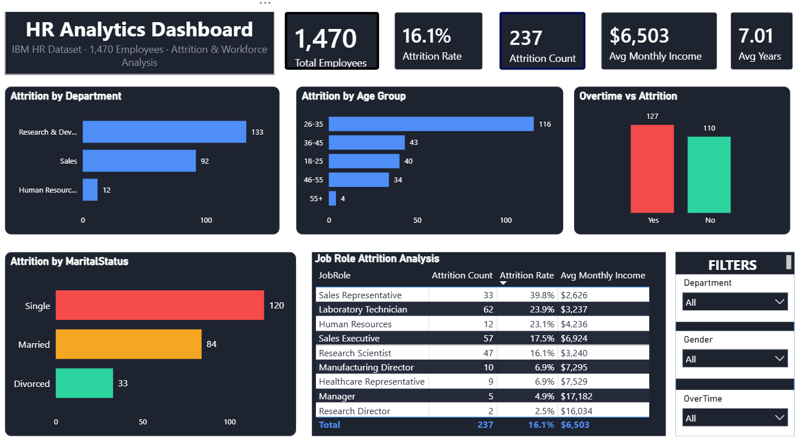

# HR Analytics Dashboard

## Project Overview
An interactive HR Analytics Dashboard built using Power BI to analyze employee data, identify attrition trends, and generate workforce insights.

The dashboard analyzes employee demographics, job roles, salary patterns, overtime impact, and attrition factors to support data-driven HR decisions.

## Dashboard Preview

## Objectives
- Analyze employee attrition patterns
- Identify factors influencing employee turnover
- Understand workforce distribution across departments and roles
- Provide HR insights through interactive visualizations

## Key Insights
- Overall employee attrition rate analysis
- Attrition comparison across departments
- Identification of high attrition job roles
- Analysis of overtime impact on employee retention
- Employee age group and marital status analysis
- Average monthly income comparison

## Features
- KPI cards for:
  - Total Employees
  - Attrition Rate
  - Attrition Count
  - Average Monthly Income
  - Average Years at Company

- Interactive filters:
  - Department
  - Gender
  - Overtime

## Tools & Technologies
- Power BI
- Power Query
- DAX
- Python (Data Cleaning & Analysis)
- Pandas
- Jupyter Notebook
- SQL

## Dataset
IBM HR Analytics Employee Attrition Dataset

## Project Files
- `HR Analytics Dashboard.pbix` - Power BI Dashboard
- `HR Analytics.ipynb` - Data Analysis Notebook
- `hr_cleaned.csv` - Cleaned Dataset
- `hr_sql.sql` - SQL Queries
- `dashboard.png` - Dashboard Preview

## Author
Tanishka Jain
